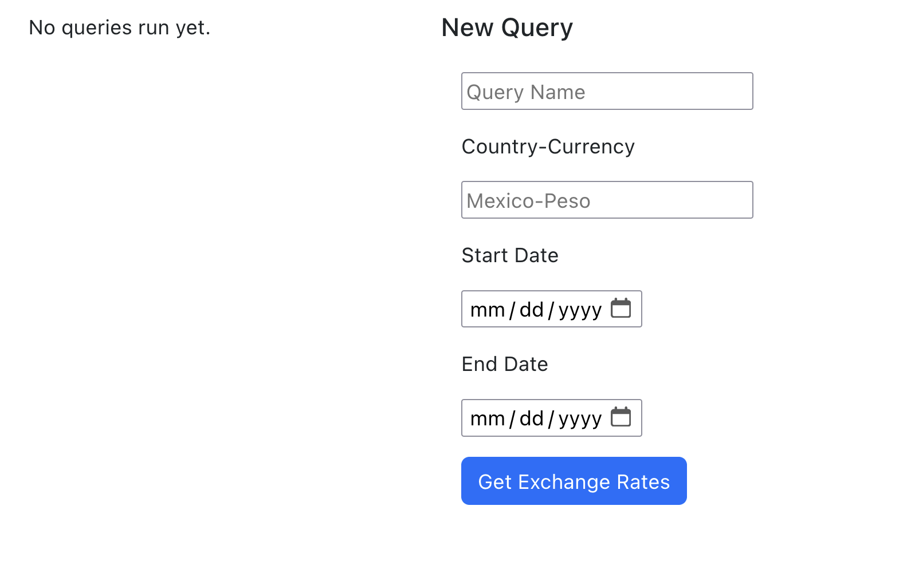

# Exchange Rates App

This a SPA react app with a .NET backend API. This app allows you to query exchange rates using this public API [endpoint](https://api.fiscaldata.treasury.gov/services/api/fiscal_service/v1/accounting/od/rates_of_exchange?fields=record_date,country,currency,country_currency_desc,exchange_rate&filter=country_currency_desc:in:(Mexico-Peso)).

The instructions for running each component of the app are in the project's README files:
- [frontend instructions](/app/README.md).
- [backend instructions](/ExchangeRatesApi/README.md)

Prior to running either project you should make sure that you've installed [.NET](https://dotnet.microsoft.com/en-us/download) and [Javascript](https://github.com/nvm-sh/nvm).

Once you've successfully started the frontend and backend servers, you should see this page at http://localhost:3000:

